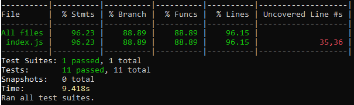
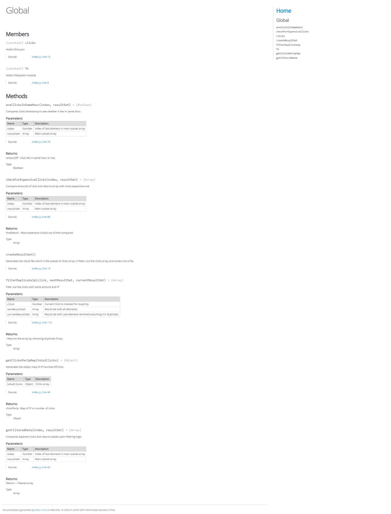

# Click Subsets Calculator

Click Subsets Calculator is a small piece javascript application that consumes an array of clicks, and return the subset of clicks where:
* For each IP within each one hour period, only the most expensive click is placed into the result set.
* If more than one click from the same IP ties for the most expensive click in a one hour period, only place the earliest click into the result set.
* If there are more than 10 clicks for an IP in the overall array of clicks, do not include any of those clicks in the result set.

## Libraries Used :
* **Jest** - Testing library for javascript functions.
* **JsDoc** - Documenting javascript functions.

## Commands :
* **npm install** - This will install all the dependencies.
* **npm run solution** - This command will produce the solution file called **resultset.json**.
* **npm run test** - This command will run the test suite.
* **npm run docs** - This command will run jsdoc and create folder called docs containing the documentation of each method used.
  
## Test Coverage

  

## Docs 

Following is the screenshot if you open ./docs/index.html :

  

